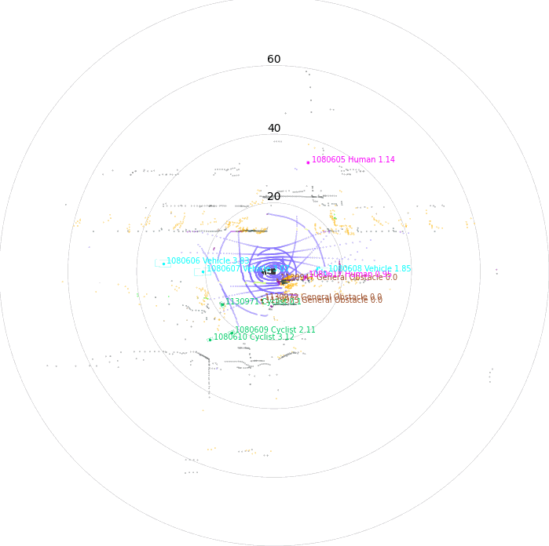
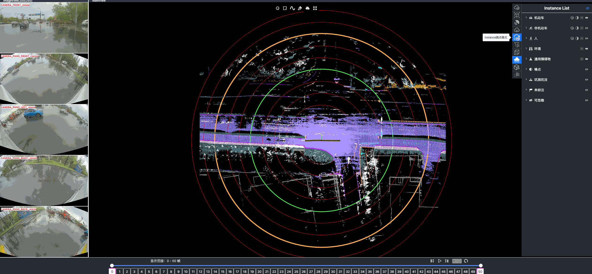

### Full-Stack Curation for Driving Clips via Powerful Auto-Labeling and Smart Quality Inspection

Raw sensor streams (Vision), driver-passenger dialogues (Language), and final driving decisions (Action) constitute three fundamental modalities for advancing Driving AI agents, supporting both low-level vehicle control and high-level task specification and execution. While ground truth for these modalities can be directly obtained from sensors and onboard systems, modern data curation and closed-loop validation pipelines continue to face two critical challenges.

**The first challenge** is to establish an effective and reliable mechanism for **distinguishing high-quality from low-quality raw driving clips**, so that data can be appropriately prioritized, filtered, and utilized during training and evaluation. This requires moving beyond coarse heuristics — such as clip duration or resolution — and instead adopting multi-dimensional quality metrics that account for sensor integrity (e.g., exposure, motion blur, calibration status), scenario richness (e.g., complex interactions, rare corner cases, diverse weather and lighting conditions), annotation completeness and accuracy, and relevance to the target behaviors and tasks the agent must learn. A robust solution typically combines **automated quality scoring models** (e.g., learned quality predictors and anomaly detectors) with **targeted human-in-the-loop review** for ambiguous or high-impact samples. This hybrid approach keeps large-scale datasets both manageable and information-rich, while minimizing noise, redundancy, and bias throughout the data pipeline.

**The second challenge** lies in our ability to deeply analyze a given driving clip and precisely **reconstruct what is happening over time** — including scene evolution, driver intent, and the causal links between perception and action. Such fine-grained understanding is valuable for both classical two-stage systems (separating perception and planning) and emerging one-stage VLA systems that rely on visual–language reasoning. By explicitly modeling and supervising intermediate cognitive steps, we can bridge raw sensory inputs and final decisions more effectively. Injecting rich intermediate signals — such as natural-language scene descriptions, explanations of other agents’ behaviors, or rationales behind specific maneuvers — provides models with structured “thought processes” rather than mere outcomes. This enhances spatial reasoning, behavior anticipation, and generalization to novel scenarios. In practice, this requires **temporally aligned multimodal annotations** (e.g., frame-level narrations, targeted Q&A for ambiguous situations, and causal explanations for interventions), transforming passive driving footage into interpretable sequences of **perceptions, hypotheses, and actions**, thereby improving both transparency and robustness.

To address these challenges, we introduce our AI infrastructure products designed to streamline end-to-end data curation. These solutions have been deployed in production for several years to support the development of Alibaba’s unmanned vehicle systems. While the core technologies are patented, we are excited to make them available commercially. We welcome inquiries regarding *licensed usage and private deployment*, as well as opportunities for deeper collaboration through *fully open-sourced, strategically aligned partnerships*.

### 1. Driving Clip Verification and Agentic Bug Reporting

For a deeper discussion on data-driven quality assurance, we recommend the insightful conclusion by my colleague **Zhongli Li** in his [Zhihu Column](https://www.zhihu.com/column/c_1974195074926662893).

> As a senior R&D and Testing Expert of Alibaba Autonomous Driving Lab, Mr. Li leads the Data-driven Quality Assurance team and has extensive experience in large-scale driving data verification and bug discovery.

### 2. Full-Modality Annotation with Human-in-the-loop Validation

| Static | Splited | Dynamic |
|---|---|---|
|  |  |  | 

Once driving clips have been verified, it is often necessary to reconstruct them in detail to support precise ground-truth validation and open-loop evaluation of key perception and decision-making tasks, including occupancy prediction, instance-level tracking, online vectorized mapping, and action selection. To this end, we developed **FusionX**, an all-in-one framework for jointly annotating perception and planning signals, providing a unified foundation for training and validating advanced Driving AI agents.

FusionX consists of two tightly coupled components that together significantly improve both annotation efficiency and quality:

1. **Spatial Modeling and Auto-Labeling:** Given a multi-sensor driving clip, FusionX first estimates high-precision sensor and motion parameters, including camera intrinsics, distortion models, extrinsics, and the ego-vehicle trajectory. Based on these estimates, it reconstructs scene geometry and appearance (e.g., textures and, where applicable, albedo) across time, while separating dynamic objects from the static background and resolving them into distinct instances. Leveraging domain-adapted Large Vision Language Models (LVLMs), FusionX performs open-vocabulary panoptic segmentation and generates structured scene representations, along with auxiliary chain-of-thought-style descriptions that capture semantic and contextual cues for downstream tasks.

2. **Manual Refinement and Quality Inspection:** Guided by confidence estimates from the auto-labeling models, professional annotators focus their efforts on ambiguous or low-confidence regions using FusionX’s specialized annotation UI. In close collaboration with tool and UI designers, annotation teams continuously refine Standard Operating Procedures (SOPs) to improve consistency and throughput. Corrections made during manual refinement are fed back into the system as additional post-training data, enabling FusionX to iteratively improve its models and achieve self-reinforcing gains in both annotation quality and efficiency.

