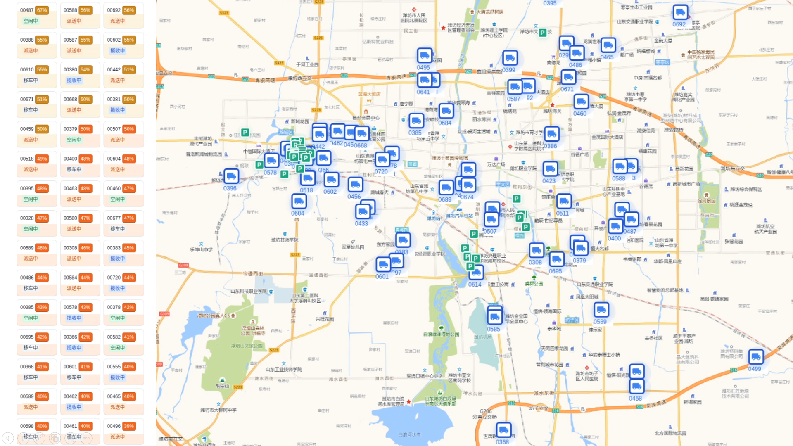
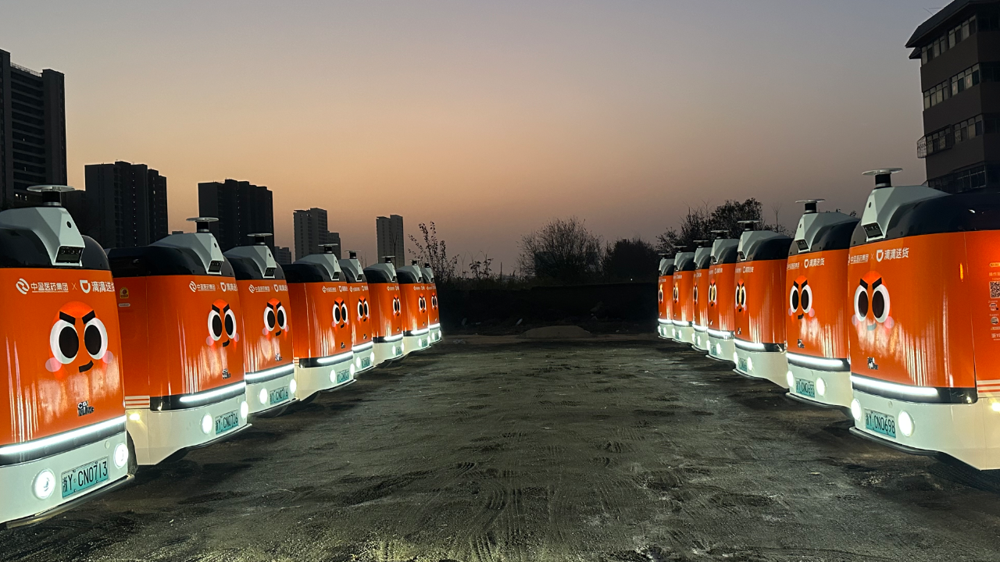

> Abstract: Autonomous cargo transportation is transitioning from experimental pilots to large-scale, revenue-generating urban services. This post presents Robovan, a city-scale autonomous logistics system successfully deployed with hundreds of unmanned vehicles operating on public roads in Weifang, Shandong. Rather than focusing on individual algorithms or hardware configurations, we outline a system-level framework — *the Five 'E's* — that enables sustainable deployment: Entrance (road access and safety), Execution (AI-driven scenario handling and rapid scale expansion), Experience (human–vehicle interaction), Economic (dispatching and ETA-aware fleet optimization), and Essential (localized operations). Together, these pillars illustrate how autonomous driving technology, operational design, and local execution must co-evolve to transform autonomy from technical capability into reliable, scalable urban logistics infrastructure.

### Robovan: Large-Scale Autonomous Cargo Transportation

We have successfully launched **hundreds of GT Unmanned Vehicles in Weifang, Shandong**, achieving one of the largest real-world deployments of autonomous cargo transportation in an open urban environment. These vehicles operate continuously on public roads, providing point-to-point cargo delivery services between customers, in a mode similar to ride-hailing platforms such as DiDi and Uber — but designed specifically for freight and logistics.

The Robovan fleet serves a diverse range of use cases, including inter-warehouse transfers, merchant-to-merchant deliveries, and time-sensitive urban logistics. Orders are generated, scheduled, and fulfilled autonomously, with vehicles dynamically dispatched based on user demand, traffic conditions, and vehicle availability. This deployment has moved beyond pilot demonstrations and entered stable, revenue-oriented operation, validating both the technical feasibility and commercial value of autonomous cargo transportation at city scale.

Robovan’s competitiveness is not defined by a single algorithm or hardware choice, but by a **system-level design** that tightly integrates safety, autonomy, operations, and local execution. Below, we summarize the key pillars — referred to as the **Five 'E's** — that enable large-scale deployment.

### 1. Entrance — Road Access and Safety First

The large-scale deployment of unmanned vehicles is not driven by technology alone. Governments must carefully balance (1) technological advancement, (2) new productive forces and labor transformation, and (3) the impact on urban traffic and public perception. To address these dimensions in a coordinated manner, operators must meet two fundamental requirements: **establishing localized remote monitoring and remote driving centers**, and **consistently maintaining extremely low rates of accidents and risky driving behaviors**. Together, these capabilities constitute the essential *entry ticket* for sustainable Robovan operations on public roads.

From an engineering perspective, safety cannot be treated as a downstream optimization problem. Before increasing the share of autonomous driving or further improving driving efficiency and user experience, the construction of a **comprehensive redundancy framework** must proceed in parallel. This redundancy extends far beyond hardware and spans the entire autonomy and operations stack, including:

1. Redundant operational monitoring and remote assistance, enabling timely human intervention and coordinated fleet-level risk management;
2. Redundant perception across multiple sensors and models, ensuring robust environment understanding under sensor degradation, adverse weather, or partial failures;
3. Redundant decision pathways for fallback behaviors, allowing the system to gracefully degrade to safer, more conservative strategies when confidence is reduced;
4. Redundant infrastructure and system design, guaranteeing controlled degradation under systemic or large-scale failure modes rather than abrupt service interruption.

Together, these layers of redundancy form the foundation that makes road access feasible, public trust attainable, and long-term Robovan operations viable at city scale.

### 2. Execution — AI meets Scenario and Scale Expansion

<video controls src="running.mp4" title="Robovan Running Day"></video>

Once road access and safety foundations are secured, the next decisive challenge lies in **execution at scale**. For Robovan operations, execution is defined by two tightly coupled capabilities: (1) the ability to drive smoothly and robustly under non-exhaustive real-world scenarios, and (2) the ability to deploy rapidly across continuously expanding urban territories. Together, these capabilities determine whether autonomous logistics can evolve from carefully constrained routes into city-wide, repeatable operations.

#### 2.1. Driving Ability — Smooth End-to-End Autonomy under Non-Exhaustive Scenarios

Urban logistics operates in a fundamentally **non-exhaustive scenario space**. Unlike structured highway driving, Robovan systems must handle temporary road changes, informal loading and stopping zones, irregular human behaviors, heterogeneous traffic participants, and long-tail corner cases that cannot be fully enumerated or encoded through rules in advance.

To address this challenge, Robovan integrates end-to-end autonomous driving models as a core component of its driving stack. These models learn continuous control policies directly from large-scale real-world and synthetic-world driving data, enabling:

1. Smooth longitudinal and lateral control, reducing unnecessary braking, hesitation, and control oscillations;
2. Human-like interaction patterns, improving coexistence with pedestrians, cyclists, and human-driven vehicles;
3. Stronger generalization to previously unseen, weakly structured, or ambiguous scenarios.

Crucially, end-to-end driving is **not deployed in isolation**. Instead, it is **deeply integrated with classical modular pipelines**, where rule-based logic, safety constraints, and deterministic fallback strategies provide structural guardrails, while learning-based policies handle uncertainty, variability, and interaction-heavy situations. This hybrid architecture allows Robovan to achieve both safety guarantees and behavioral fluency, particularly in dense urban logistics environments where purely rule-based systems fail to scale.

#### 2.2. Fast Deployment — Rapid Expansion via Lightweight Map Solutions

Execution at scale is equally constrained by **deployment velocity**. Traditional high-definition maps are expensive to build, slow to update, and difficult to maintain under rapidly changing urban conditions, making them incompatible with the pace required for city-scale logistics expansion.

Robovan adopts our published work **RTMap (ICCV 2025)**, a lightweight mapping framework in which maps capture essential structural and semantic priors without exhaustive annotation. Combined with robust online perception and localization, this approach enables:

1. **Fast route onboarding** with safety guarantees across multiple map granularities — *Full-HD, Light-HD, SD Pro, and Freespaces* — allowing new roads and service zones to be deployed in days rather than weeks;
2. **Progressive map evolution**, supporting asynchronous and silent Operational Design Domain (ODD) transitions across different map granularities, with auto-labeling techniques significantly reducing mapping and maintenance costs;
3. **Agile operational rule broadcasts**, enabling rapid adaptation to construction changes, traffic policy updates, and business-driven route adjustments.

By combining **end-to-end driving intelligence** that generalizes across non-exhaustive scenarios with a **lightweight, progressive mapping framework** that supports rapid geographic expansion, Robovan establishes a practical execution layer for large-scale autonomous logistics. This layer ensures that autonomy is not confined to isolated routes or static environments, but can **continuously scale with real-world complexity, operational demand, and urban change**, laying a solid foundation for service optimization and higher-level dispatching.

### 3. Experience — Human-Vehicle Interaction

<video controls src="night-parking.mp4" title="Robovan Stopping Night"></video>

Unlike passenger ride-hailing, autonomous cargo logistics inherently involves **frequent and necessary human interaction**. Merchants, warehouse operators, and receivers all interact with the vehicle during pickup and delivery, making the **handover process** one of the most complex and operationally sensitive stages of the entire service lifecycle.

To address this challenge, Robovan incorporates **Visual-Language eXpansion (VLX)** at the execution layer, enabling natural, flexible, and reliable human-vehicle interaction beyond conventional touchscreen or rule-based interfaces. Specifically, these expansions include:

1. **Recognition (VLM)** — Open-vocabulary visual recognition of shipped cargo, allowing the system to identify anomalous, risky, or potentially illegal items, and to flag tasks that violate operational or regulatory constraints；
2. **Navigation (VLN)** — Natural-language understanding of human instructions related to parking location selection, loading and unloading positions, and final docking decisions in unstructured or informal environments;
3. **Action (VLA)** — Language-conditioned execution of vehicle movements, enabling operators or receivers to instruct the vehicle to perform specific maneuvers during pickup and delivery.

These language-enabled capabilities significantly improve both **user experience and operational efficiency** at packing and receiving points — phases that are often the most *intimate, time-spanning, and failure-prone segments* of cargo logistics. By introducing language as a first-class interaction modality, Robovan allows non-technical users to interact with unmanned vehicles intuitively, safely, and with minimal post-training.

Importantly, most human-vehicle interactions in logistics are **not time-critical at millisecond scale**. Unlike driving decision-making, which demands real-time responsiveness, interaction sequences typically occur at a much lower temporal frequency. This tolerance enables the system to prioritize **robust understanding, confirmation, and safety checks** over raw reaction speed, and to flexibly leverage **cloud-based or remote-assisted execution** when appropriate — further improving reliability during handover operations.

### 4. Economic — Dispatching and ETA-aware Docking Section

The validation and long-term optimization of an autonomous logistics business model cannot be separated from scale effects. At the city level, this scale is realized through **fleet-level capability**, built upon the vehicle autonomy, product design, and human-vehicle interaction foundations described earlier. While many aspects of fleet operation resemble those of traditional ride-hailing platforms, removing human drivers physically from the vehicle introduces a new class of challenges that must be addressed systematically via data-driven techniques:

1. **Autonomous energy replenishment and localized operations become core economic constraints**. Without human drivers, vehicles must independently complete charging or refueling workflows, while cities must support localized infrastructure — including sites, facilities, and operational staff. The key question is how to design and place this infrastructure to maximize **Return on Investment (ROI)**, ensuring high vehicle utilization without overbuilding costly assets.
2. **ETA estimation and route planning become significantly more complex under current regulatory and traffic conditions**. In many cities, autonomous freight vehicles *do not yet enjoy the same traffic privileges* as passenger vehicles, and operational fleets often start with limited-scale samples. Robovan addresses this by combining fleet-specific historical data, real-time traffic feedback, and regulatory constraints to produce accurate ETA predictions and continuously optimized routing strategies — balancing transportation efficiency with compliance and safety requirements.
3. **Urban logistics demand is highly non-uniform**. Freight demand concentrates around specific vertical hubs — such as wholesale markets, industrial parks, and commercial distribution centers — rather than being evenly distributed across the city. To improve fleet economics, Robovan evaluates the **strategic placement of temporary docking and staging zones** near these high-density nodes. Such zones enable vehicles to reduce idle mileage and increase each vehicle’s revenue-effective loaded kilometers, directly improving per-vehicle profitability.

Dispatching, ETA-aware docking selection, and fleet-level optimization form the **economic engine** of Robovan operations. By tightly integrating autonomous driving capabilities with intelligent dispatching, infrastructure planning, and demand-aware docking strategies, Robovan transforms autonomous vehicles from isolated technical assets into **scalable, revenue-generating logistics infrastructure** — a prerequisite for sustainable city-scale deployment.

### 5. Essential — Local Operations

Large-scale autonomous logistics does not succeed on algorithms and technical frameworks alone. A **critical yet often underestimated component** is localized operations — sometimes informally referred to as *dirty works*. We prefer to call them *glorious works*, as they form the essential execution layer that determines whether autonomy can sustain real-world deployment.

These operational capabilities bridge the gap between autonomous systems and the physical, regulatory, and human environments in which they operate. Key elements include, but are not limited to:

1. **Clear separation and coordination between autonomous driving and human-assisted operations**, such as remote intervention, on-site support, and exception handling. A well-defined interface between the two ensures safety, accountability, and operational continuity;
2. **On-site maintenance, emergency response, and fleet hygiene**, including continuous vehicle health monitoring, timely maintenance, incident response, and standardized cleanliness and safety checks — essential for reliability and public trust;
3. **Product tailoring for local regulations and customer needs**, adapting vehicle configurations, software policies, and service workflows to city-specific regulatory requirements and usage patterns while preserving platform-level consistency;
4. **Cargo safety mechanisms**, including loading constraints, anti-theft systems, sealing verification, and handover confirmation, deeply integrated into vehicle design and operational workflows to ensure cargo integrity.

By embedding these operational realities directly into product architecture, autonomy design, and fleet workflows, Robovan avoids the trap of fragile, demo-driven deployments. Instead, it establishes a grounded, repeatable, and scalable operational model, capable of sustaining long-term autonomous logistics services across cities and use cases.

### Conclusion

The Robovan deployment demonstrates that large-scale autonomous cargo transportation is no longer a future concept, but an operational reality when approached as a complete system rather than a standalone technology. Success at city scale requires far more than autonomous driving performance: it demands regulatory alignment, safety-by-design redundancy, scenario-generalizing intelligence, rapid deployment capability, human-centered interaction, fleet-level economic optimization, and disciplined local operations.

By structuring Robovan around the Five 'E's, we show how autonomy can be transformed from isolated demonstrations into repeatable, revenue-generating infrastructure that operates continuously on real roads, for real customers, under real constraints. As cities evolve and logistics demands grow, this system-oriented approach provides a practical blueprint for scaling autonomous mobility — grounded not only in algorithms, but in operations, economics, and human collaboration.