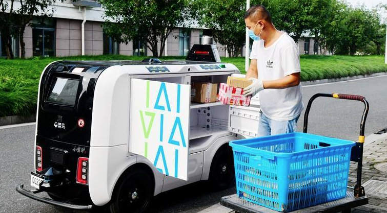
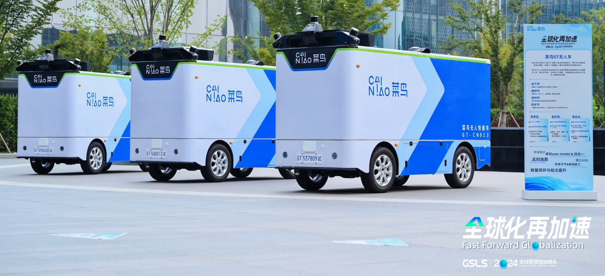
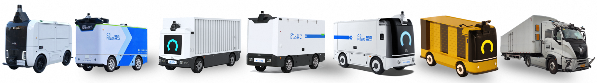
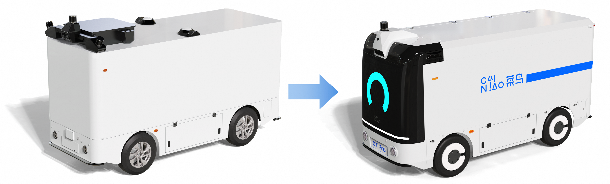
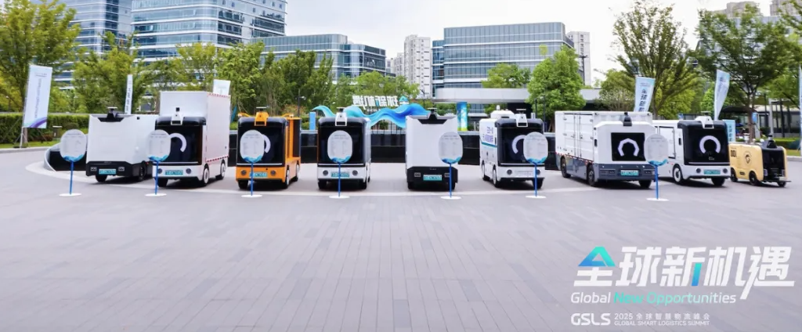

### GX - The "Last Three Kilometers" Solution for Closed Parks

On September 17, 2020, at the Yunqi Conference, Alibaba unveiled its first logistics unmanned vehicle, the “Small Savage Donkey.” By March 31, 2023, the fleet had grown to more than 700 vehicles, operating across 20+ provinces and serving over 400 colleges and universities, with a cumulative total of 30+ million delivery orders completed.

Behind the “Small Savage Donkey” is a **full-stack autonomous driving system**, integrating multi-sensor fusion perception (LiDAR, cameras, and GNSS), high-precision localization and mapping, and robust path-planning algorithms tailored for complex campus and semi-urban environments. Onboard edge computing enables real-time decision-making for obstacle avoidance and safe interaction with pedestrians, while cloud-based scheduling and fleet-management systems optimize routing, charging, and task allocation at scale. Together, these capabilities allow GX to operate reliably in diverse scenarios, significantly improving last-mile logistics efficiency and service quality.

### GT - L4 Autonomous Delivery for City-Scale Logistics

Building on the successful mass production of GX, our team independently designed and developed the next-generation unmanned vehicle in September 2023: CaiNiao GT. GT is a fully driverless logistics vehicle powered by advanced **end-to-end autonomous driving technologies**. It is capable of intelligent route planning, dynamic avoidance of obstacles and hazards, and safe, efficient operation on complex urban roads, supporting **tens of kilometers of continuous transportation** with high reliability.

### Low-Cost Sensor-Computing Suite with a Unified Model

With rapid advances in artificial intelligence and computer vision, we continue to **optimize and simplify our sensor and computing stack**, aiming to reduce the overall Bill of Materials (BOM) while preserving strong safety and efficiency guarantees. This approach strengthens the commercial competitiveness of our autonomous logistics platform without compromising performance.

In particular, by upgrading our off-board visual reconstruction and on-board visual ranging capabilities, we have introduced an innovative sensor configuration that, **for the first time in urban logistics scenarios, relies on a single LiDAR and eleven cameras**. This design replaces the previous four-LiDAR, eight-camera setup while achieving a similarly low incidence of risky behaviors and maintaining robust performance at night and under adverse weather conditions.

